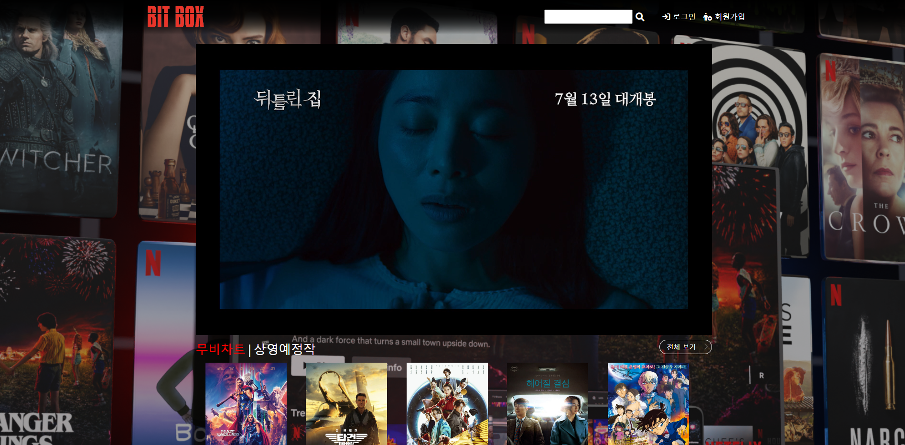
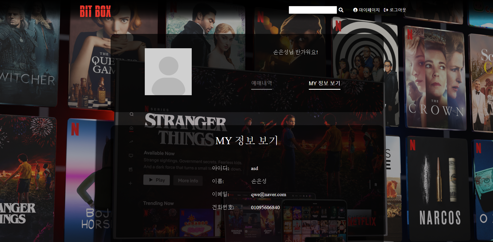
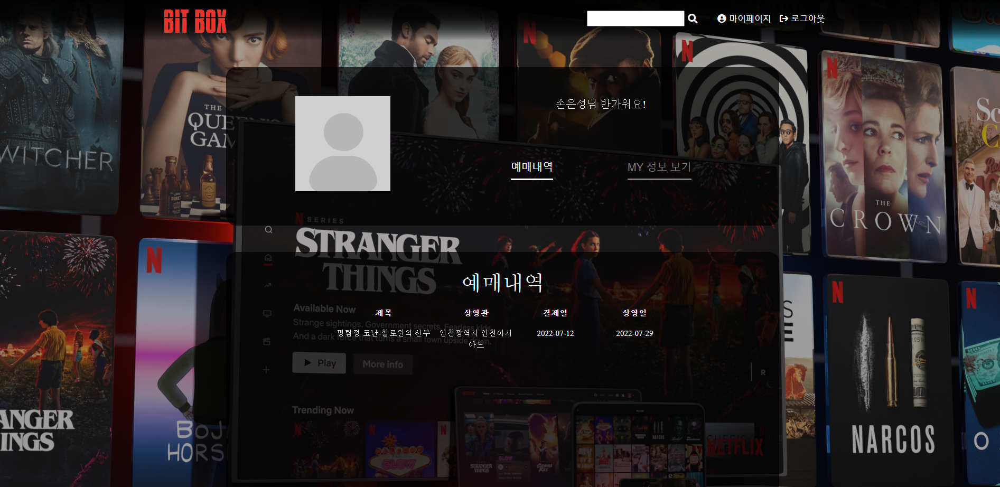
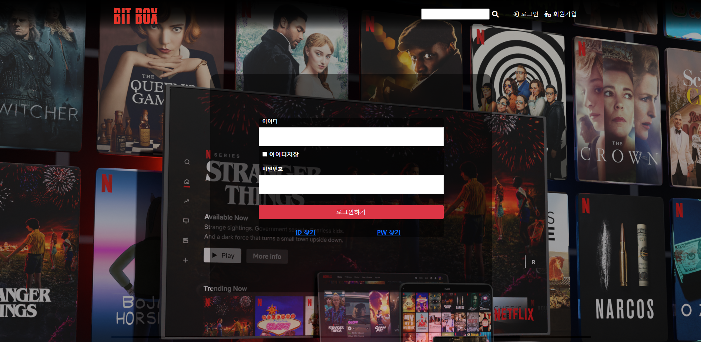
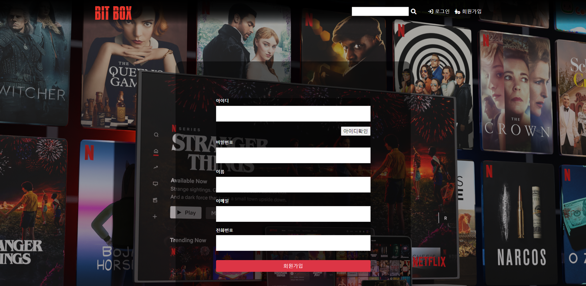
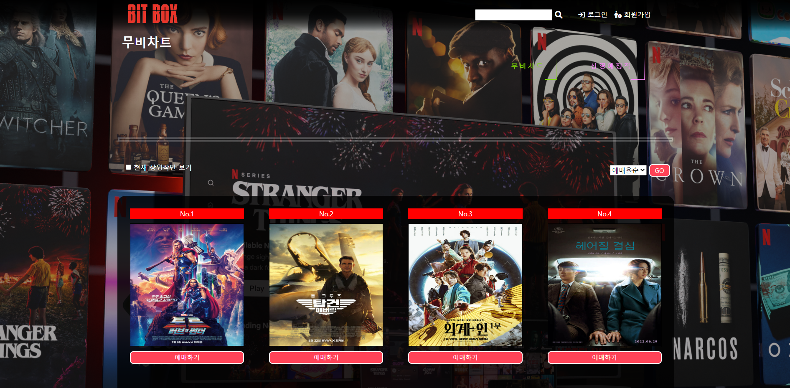
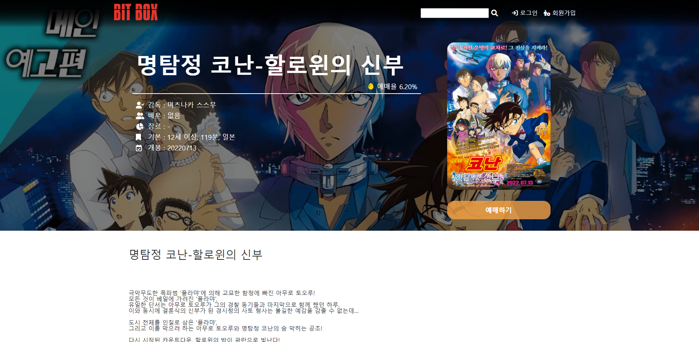
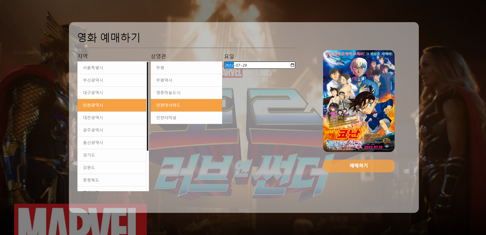
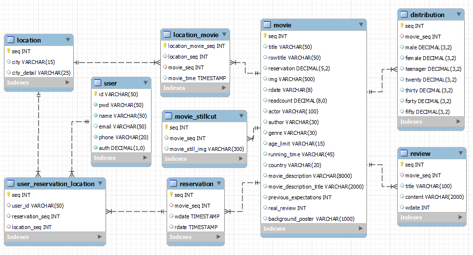

## **🎞 서비스 소개**

### **🔶 주제**

크롤링을 통한 실시간 영화 정보 확인 및 예매를 위한 사이트

 

### **🔶 개요**

- 개발기간
- 팀원정보
- 서비스 기획
  - 기획의도
- Frontend
  - UI
- Backend
  - DB 설계
- 주요 기능
  - 메인

 

### **🔶 개발 기간**

**2022.07.08 ~ 2022.07.12**

 

### **🔶 팀원정보**

### 도수호
- 예매 페이지 BE
- 상세 페이지 BE
- 영화 상세정보 크롤링
- DB설계 및 구현

### 서지훈
- 마이페이지 기능 구현(DB에서 회원정보 및 예약 내역 출력) 및 UI디자인
- Navbar, Footer 디자인,
- 공통폰트 & 공통테마이미지 선정,
- Logo & Favicon 이미지 디자인,
- 기타 페이지 상세 UI 구현
- MemberDB 설계

### 손은성
- 영화 지역, 상영관 크롤링 구현
- 영화관 정보 BE 구현
- 영화 예매 UI / 기능구현
- 영화 상세보기 UI / 기능구현
- Navbar 디자인
- DB설계 및 구현

### 오재곤
- 상영예정작 크롤링 구현
- ajax를 활용하여 상영영화 비동기 처리 구현
- 무비 차트 및 상영 예정작 UI / UX 개발
- Search Logic 구현
### 정다은
- 로그인 FE / BE
- 로그아웃 FE / BE
- 회원가입 FE / BE
- 회원탈퇴 FE / BE
- id찾기 FE / BE
- pw찾기 FE / BE

### 최형준
- 메인영화 크롤링 구현
- ajax를 활용하여 메인영화 비동기 처리 구현
- 메인 화면 및 무비 차트 UI / UX 개발
- Search Logic 구현

  

## **✏ 서비스 기획**

### **🔶 기획의도**

- Crawling 기반 데이터 수집, JSP와 Servlet을 활용한 영화 예매 사이트 구현

 

### **🌐FrontEnd**

#### **UI**

### 메인 페이지

### 마이 페이지 - 내 정보 확인

### 마이 페이지 - 예약 내역 확인

### 로그인 페이지

### 회원가입 페이지

### 영화 목록 페이지

### 영화 상세보기 페이지

### 영화예약 페이지

 
 

### **🌐Backend**

#### **DB 설계**

  

## **🎥 주요 기능**

### 메인 페이지 / 영화 상세보기

### 회원가입 / 아이디 찾기 / 비밀번호 찾기

### 로그인 페이지 / 로그아웃

### 영화 예매 / 마이페이지 - 예매내역 확인

### 영화 상세보기 페이지
- 예매율순
- 제목순
- 개봉일순
- 현재 상영작

### ✉Contact

- 도수호: tngh147258@gmail.com
- 서지훈: jhseo03131@gmail.com
- 손은성: dmstjd3256@naver.com
- 오재곤: opve555@gmail.com
- 정다은: opve555@gmail.com
- 최형준: opve555@gmail.com

 
 
 

## **🖥 포팅 메뉴얼**
1. Git Clone 하기
2. Database Schema 안에 Schema 복사해서 movie_reservation_db에 생성
3. index.jsp 실행
